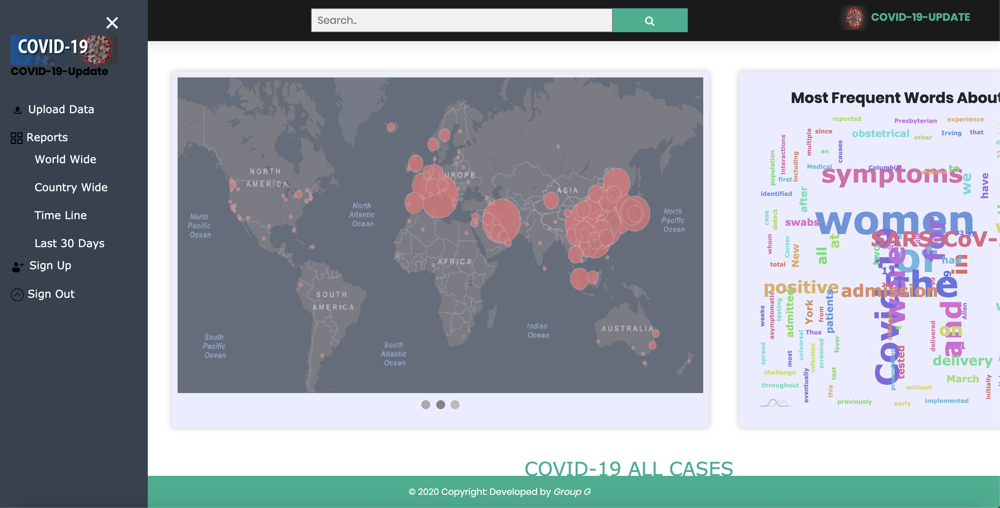
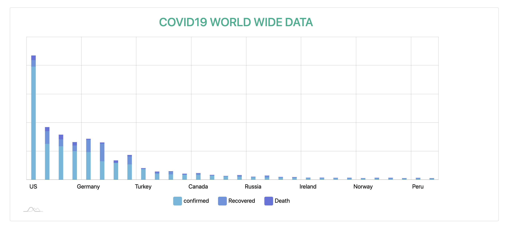
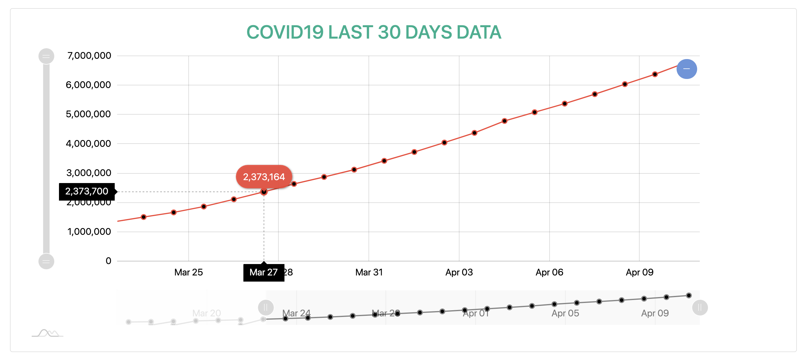
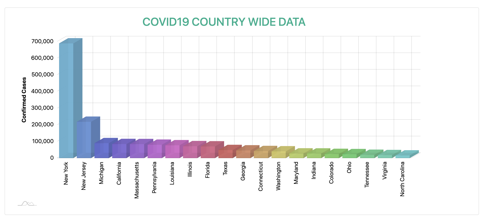
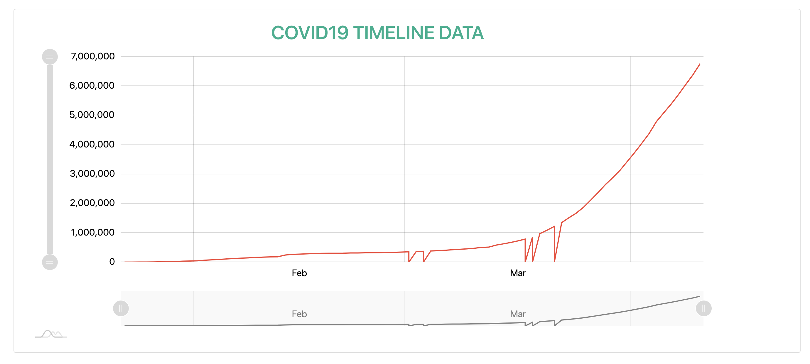

# Visualization of COVID-19 Breakout Around The World

## Introduction
COVID  -19  a  virus  of  the  same  group  as  SERS,MERS   and   the   destroyer   of   the   current   civilization.   
It   hasalready been spread throughout the world and this situation hasalready  been  declared  as  pandemic.  This  virus  
spread  throughaffected  people’s  droplets,  and  any  kind  of  close  contact.  Sothis  is  very  much  important  to  
make  people  aware  about  thispandemic  and  day  to  day  information  so  that  they  can  makethem   safe   theirself.   
It   is   the   motive   to   make   a   meaningfulvisualization  of  this  pandemic  through  different  charts,  graphsand  
tables  and  timeline  through  a  website.  Where  people  canfind  information  about  daily  as  well  as  monthly  new,  
recoveredand death cases throughout the world and for specific countries.Apart  from  that  users  of  the  site  can  sign  
up  to  this  systemand  contribute  though  data  by  uploading  CSV  files.  To  developthis   application   we   chose   
to   use   django   as   a   backend   webframework   and   javascript,   html,   css   in   the   front   end.   
Thefollowing  sections  of  this  report  will  consist  of  Introduction,methods,  implementation,  future  work  and  conclusion.

## Data Collection
Data  about  the  COVID-19  pandemic  is  being  aggregated  andprepped  in  a  rapid  clip  as  tech  vendors  are  
creating  a  stack  ofanalysis  tools  for  amateur  epidemiologists  as  well  as  data  sciencewonks. This novel coronavirus 
outbreak may be the most visualizedever.  From  all  of  these  available  datasets  I  prefer  to  have  one  fromkaggle 
which contains information including date, country, province,confirmed case, recovered case, death case from 22nd january 
to 10thapril.

Datasource: https://www.kaggle.com/sudalairajkumar/novel-corona-virus-2019-datasetcovid19data.csv

## Data Prepossessing
The most important part of data driven application is to prepossessthe  data.  Before  upload  the  data  to  the  system  
first  thing  have  tobe  done  is  to  make  the  column  name  fixed  as  used  in  the  system to extract each column value. 
Then visualize some information likenumber  of  null  values,  max  value,  min  value  and  avg  value,  umberof rows in 
each column. From this information I have to make sureevery column has equal number of rows, no null values. and 
speciallycheck  the  min  and  max  value  rows  of  each  column  to  validate  thedata.

## Software, Tools, Libraries, Packages
To start our project, we started from the scratch. No initial templatewas used. The following languages and frameworks 
have been usedto implement our project.

* Bootstrap
* HTML
* CSS
* JavaScript
* JQuery
* Django
* Sqlite
* Pandas
* AmChart
* ChartJs
* PyCharm

## Features:

Fig 1: Home Page of contains a map, word bank, side bar and top search bar

 
 Fig 2: Country wise number of affected people.
 
 
 Fig 3: Country wise number of affected people date wise for last 30 days
 
 
 Fig 4: City wise number of affected people for a country in 3D Chart
 
 
 
 Fig 5: Country wise number of affected people date wise till current date from the beginning
 